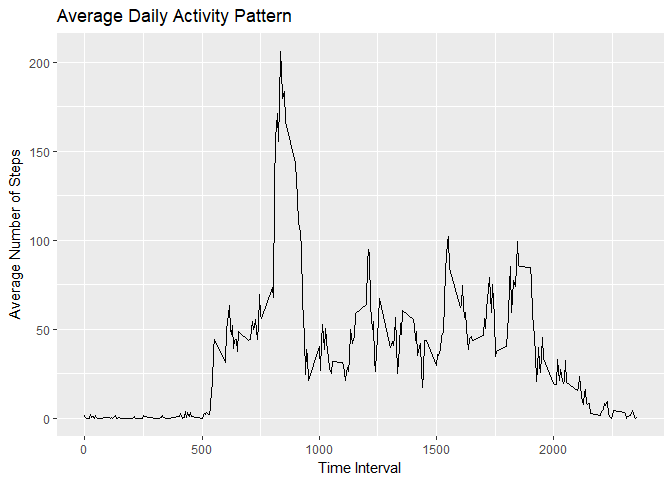
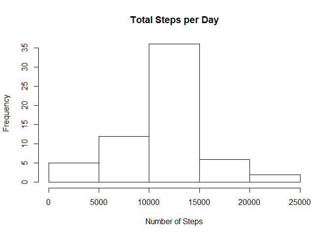
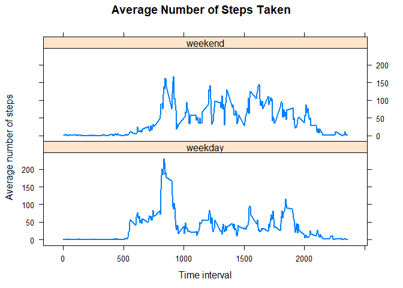

## Loading and preprocessing the data

Unzip the data file and load it into R


```r
activity<- read.csv(file="activity.csv", header=TRUE)
activity$date <- as.Date(activity$date, format = "%Y-%m-%d")
```

## What is mean total number of steps taken per day?


```r
# Calculate the total steps taken per day
ts <- aggregate(steps ~ date, activity, FUN=sum)

# Make a histogram of the total number of steps taken per day
hist(ts$steps,
     main = "Total Steps per Day",
     xlab = "Number of Steps")
```

<!-- -->

```r
# Calculate and report the mean and median of the total number of steps taken per day
meanSteps <- mean(ts$steps, na.rm = TRUE)
medianSteps <- median(ts$steps, na.rm = TRUE)

meanSteps
```

```
## [1] 10766.19
```

```r
medianSteps
```

```
## [1] 10765
```

## What is the average daily activity pattern?


```r
##1. Make a time series plot (i.e. type = "l") of the 5-minute interval (x-axis) and the average number of steps taken, averaged across all days (y-axis)
library(ggplot2)
```

```
## Warning: package 'ggplot2' was built under R version 3.4.4
```

```r
meanStepsInterval <- aggregate(steps ~ interval, activity, mean)

ggplot(data = meanStepsInterval, aes(x = interval, y = steps)) +
  geom_line() +
  ggtitle("Average Daily Activity Pattern") +
  xlab("Time Interval") +
  ylab("Average Number of Steps") 
```

<!-- -->

```r
## 2. Which 5-minute interval, on average across all the days in the dataset, contains the maximum number of steps?
maxSteps <- meanStepsInterval[which.max(meanStepsInterval$steps),]
maxSteps
```

```
##     interval    steps
## 104      835 206.1698
```


## Imputing missing values


```r
##1.Calculate and report the total number of missing values in the dataset (i.e. the total number of rows with NAs)
sum(is.na(activity))
```

```
## [1] 2304
```

```r
## 2. Devise a strategy for filling in all of the missing values in the dataset.
## I am replacing NA value with mean.

## 3. Create a new dataset that is equal to the original dataset but with the missing data filled in.
activity2 <- activity
for (i in 1:nrow(activity)) {
  if (is.na(activity$steps[i])) {
    interval_value <- activity$interval[i]
    steps_value <- meanStepsInterval[
      meanStepsInterval$interval == interval_value,]
    activity2$steps[i] <- steps_value$steps
  }
}


## 4. Make a histogram of the total number of steps taken each day and Calculate and report the mean and median total number of steps taken per day.
ts2 <- aggregate(steps ~ date, data = activity2, sum, na.rm = TRUE)
hist(ts2$steps,
     main = "Total Steps per Day",
     xlab = "Number of Steps")
```

<!-- -->

```r
# Calculate and report the mean and median of the total number of steps taken per day
meanSteps2 <- mean(ts2$steps)
medianSteps2 <- median(ts2$steps)

meanSteps2
```

```
## [1] 10766.19
```

```r
medianSteps2
```

```
## [1] 10766.19
```
Do these values differ from the estimates from the first part of the assignment? What is the impact of imputing missing data on the estimates of the total daily number of steps?
The mean is the same, but the median is not. 
Imputing missing data using the mean decreases the variation of the data set. Because more data points equal to the mean, the median is getting closer to the mean as well.

## Are there differences in activity patterns between weekdays and weekends?
1. Create a new factor variable in the dataset with two levels - "weekday" and "weekend" indicating whether a given date is a weekday or weekend day.

```r
activity2$day <- weekdays(activity2$date)
activity2$daytype <- ""
activity2[activity2$day == "Saturday" | activity2$day == "Sunday", ]$daytype <- "weekend"
activity2[!(activity2$day == "Saturday" | activity2$day == "Sunday"), ]$daytype <- "weekday"
activity2$daytype <- factor(activity2$daytype)
```
2. Make a panel plot containing a time series plot (i.e. type = "l") of the 5-minute interval (x-axis) and the average number of steps taken, averaged across all weekday days or weekend days (y-axis). See the README file in the GitHub repository to see an example of what this plot should look like using simulated data.

```r
meanStepsInterval2 <- aggregate(steps ~ interval + daytype, data = activity2, mean)
library(lattice)
xyplot(steps ~ interval | daytype, data = meanStepsInterval2, type = "l", lwd = 2,
       layout = c(1, 2), 
       xlab = "Time interval", 
       ylab = "Average number of steps",
       main = "Average Number of Steps Taken")
```

<!-- -->


